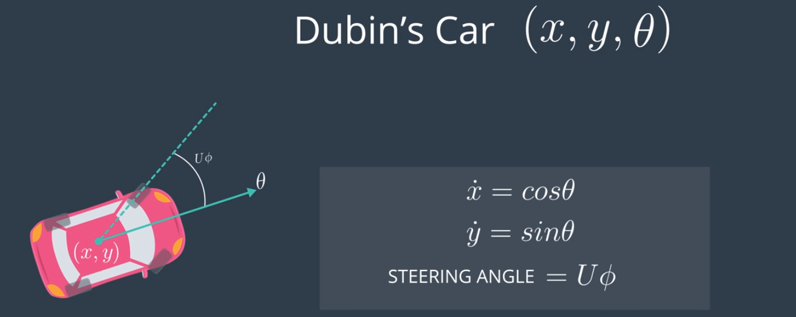
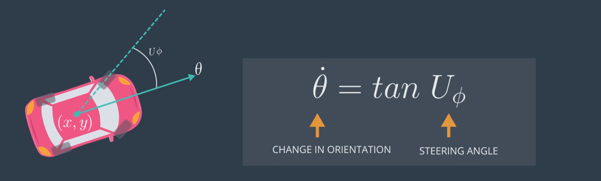
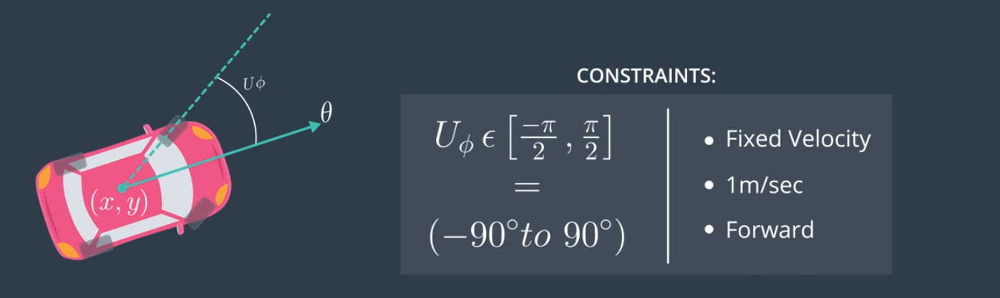
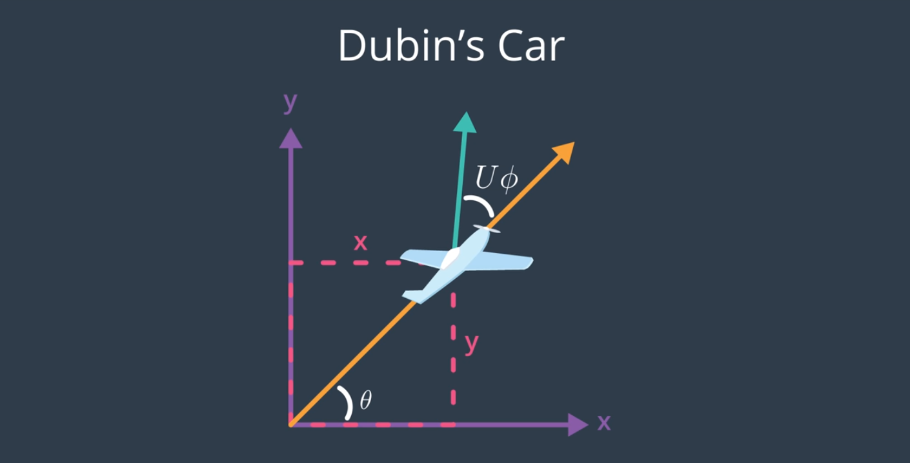

# AAE_Notebook_016_DubinsCar
In this notebook, we're going to discuss the Dubin's Car model and curved flight trajectories as a function of inertia.

The dynamic models that we've discussed, thusfar, have constraints that involve just the current state. Remember, however, we have an autopilot that allows us to control the motion of the vehicle; so, it also makes sense to incorporate the control into the differential constraints as well.

A very common dynamics model is what is known as the Dubin's car. It has states X, Y, and theta and has a dynamics model that is x-dot is equal to the cosine of the current orientation and y-dot is the sine of the current orientation. U-Phi is the steering angle. (We'll, generally, use U to denote controls that we're giving the vehicle.)

The change in orientation of the vehicle is the tangent of the steering angle.

Let's say that the steering angle is limited to be in the range minus pi over two to pi over two. (So, negative 90 to positive 90 degrees.) Implicit in this is an assumption that the vehicle is moving at a fixed velocity of one meter per second in the forward direction.

The Dubin's car is not a particularly great representation of a quadrotor; however, it is a pretty good model for a fixed-wing aircraft. There's an easy way to convert the steering angle in the model into a flight path angle and bank angle commands that you would normally give to a fixed wing autopilot.

Unlike a fixed-wing aircraft, the autopilot for a quadrotor would have to constantly adjust the thrust vector through the curve. (There isn't a single setting of the controls that will make the quadrotor follow a curved path described by a specific steering angle.)

That being said, unless the quadrotor stops at each waypoint, the inertia of the vehicle is going to cause it to follow somewhat of a curved path as it changes directions and moves through a waypoint. As the vehicle adjusts the thrust of individual motors in order to change the thrust vector, the quadrotor is going to follow a curved path as a function of inertia.
